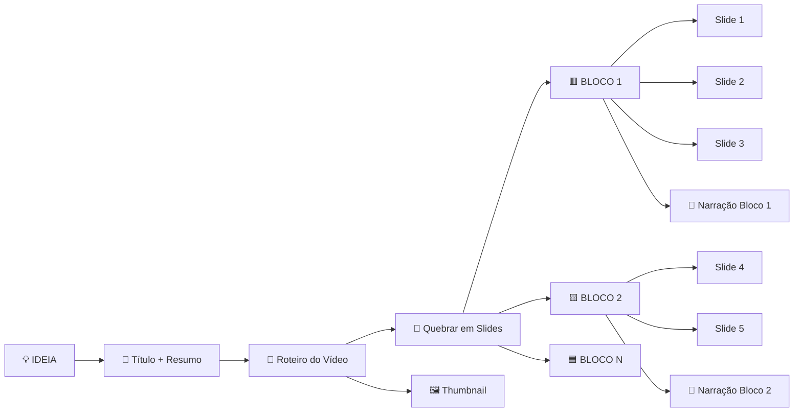
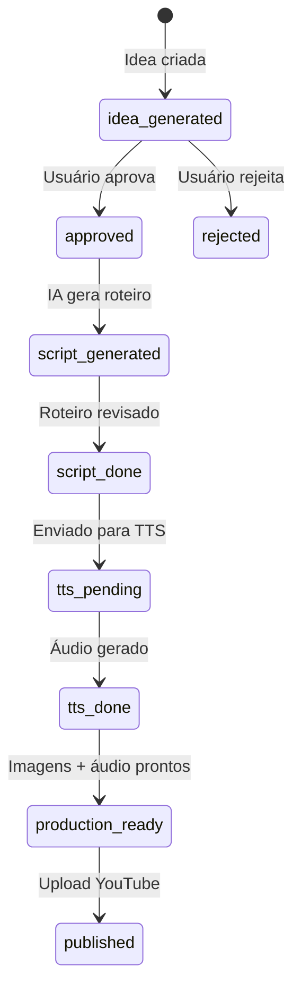

# 🎬 AutoDark — Pipeline de Criação de Vídeo

> **Documento de referência para TODAS as IAs e devs do backend.**
> Última atualização: 2026-03-18

---

## 📐 Diagrama Principal do Fluxo



### Explicação Visual (do diagrama do fundador):

```
IDEIA 
  → Título + Resuminho 
  → Roteiro do Vídeo 
  → quebrar em slides → BLOCO 1
                            ├── Slide 1 ("Bruno saindo de casa")
                            ├── Slide 2 ("Encontra gui na padaria")
                            ├── Slide 3 ("Compra pão e volta")
                            └── Narração Bloco ("Era uma vez bruno que saia...")
  → Thumbnail
```

---

## 🏗️ Arquitetura de Dados (Supabase)

### Tabelas Envolvidas

| Tabela | Papel | Campos Chave |
|--------|-------|-------------|
| `channels` | Canal do YouTube | `id`, `name`, `niche`, `user_id` |
| `channel_blueprints` | **Personalização do canal** (DNA) | `channel_id`, `topic`, `persona_prompt`, `script_rules`, `visual_style`, `char_limit`, `cta`, `voice_id`, `character_description`, `scenes_image_ratio` |
| `channel_contents` | Cada vídeo/conteúdo produzido | `channel_id`, `title`, `hook`, `topic`, `script`, `scenes` (JSONB), `audio_url`, `srt_url`, `slide_images` (JSONB), `thumbnail_url`, `status` |
| `content_ideas` | Ideias geradas pela IA | `channel_id`, `title`, `concept`, `score`, `status` |
| `long_video_contents` | Vídeos longos | `channel_id`, `scenes` (JSONB), `full_audio_path`, `video_path` |

### Status Flow de `channel_contents`



---

## 🧬 Personalização por Canal (OBRIGATÓRIO)

Cada canal tem um **Blueprint** (`channel_blueprints`) que é o DNA que personaliza TUDO:

| Campo Blueprint | O que controla | Exemplo |
|----------------|----------------|---------|
| `topic` | Tema central do canal | "Histórias bíblicas para crianças" |
| `persona_prompt` | Personalidade do narrador/roteirista | "Você é um narrador misterioso e tenebroso..." |
| `target_audience` | Público alvo | "Cristãos evangélicos, 25-45 anos, Brasil" |
| `script_rules` | Regras de escrita que a IA DEVE seguir | "Sempre começar com pergunta. Max 500 chars." |
| `visual_style` | Estilo das imagens geradas | `realistic`, `cartoon`, `oil-painting`, `clay`, `vector` |
| `char_limit` | Limite de caracteres do script | 500 |
| `cta` | Call-to-action padrão | "Se inscreva e ative notificações!" |
| `voice_id` / `voice_name` | Voz TTS padrão | "onyx", "alloy", "echo" |
| `character_description` | Personagem consistente nas cenas | "Homem idoso com barba branca, túnica azul" |
| `character_consistency` | Manter mesmo personagem em todas as cenas | `true` / `false` |
| `style_reference_url` | URL de imagem de referência para estilo visual | "https://..." |
| `scenes_image_ratio` | % de cenas com imagem estática | 70 |
| `scenes_video_ratio` | % de cenas com vídeo VO3 | 30 |
| `custom_music_url` | Música de fundo | "https://...mp3" |
| `videos_per_batch` | Quantas ideias gerar por batch | 4 |
| `reference` | Fonte de referência (ex: Bíblia) | "Bíblia NVT" |

> **REGRA DE OURO:** Toda Edge Function que gera conteúdo DEVE consultar `channel_blueprints` e usar os campos para personalizar a geração.

---

## 📞 Edge Functions — Contrato de API

### 1. `generate-ideas`
**Gera batch de ideias de vídeos**

```typescript
// INPUT
{ channelId: string }

// OUTPUT
{ success: true, count: number, ideas: ContentIdea[] }

// CONSULTA: channel_blueprints (videos_per_batch, topic, persona_prompt, reference)
// GRAVA EM: channel_contents (status: "idea_generated")
```

### 2. `generate-script`
**Gera roteiro para um conteúdo aprovado**

```typescript
// INPUT
{ contentId: string }

// OUTPUT
{ success: true, content: ChannelContent, char_used: number }

// CONSULTA: channel_blueprints (char_limit, cta, script_rules)
// ATUALIZA: channel_contents.script, status → "script_generated"
```

### 3. `youtube-generate-audio`
**Gera áudio TTS da narração**

```typescript
// INPUT
{ text: string, voice?: string }

// OUTPUT
ArrayBuffer (audio/mpeg)

// USA: AI33_API_KEY → api.ai33.pro/v1/audio/speech
// FALLBACK: browser SpeechSynthesis (frontend-only)
```

### 4. `youtube-long-engine`
**Gera roteiro em blocos para vídeo longo**

```typescript
// INPUT
{ topic: string, channelContext?: string }

// OUTPUT
{
  success: true,
  script: {
    title: string,
    description: string,
    tags: string[],
    scenes: [{
      id: string,
      director_notes: string,
      narration_text: string,           // APENAS o que o narrador fala
      visual_prompt_for_image_ai: string, // Prompt em inglês para DALL-E/Kie
      estimated_duration: number          // segundos
    }]
  }
}

// USA: OPENROUTER_API_KEY → google/gemini-2.5-flash
```

### 5. `generate-kie-flow`
**Fluxo end-to-end com Kie.ai**

```typescript
// INPUT
{ channelId: string, topic: string }

// OUTPUT
{ script: string, images: string[], videoUrl?: string, status: 'success' | 'error' }

// STATUS: ⚠️ MODO MOCK (real API implementation pending)
```

### 6. `generate-strategy` / `generate-directives`
**Head Agent — gera estratégia para o canal**

```typescript
// INPUT
{ channelId: string }
// OUTPUT
{ ideas, competitors_analysis, growth_strategy }
```

---

## 🎨 UserFlow Frontend (Step-by-Step)

### Wizard de Produção (`/production`) — 8 Steps

| Step | Nome | O que acontece | Edge Function |
|------|------|---------------|---------------|
| 1 | **Ideia e Título** | Usuário digita tema, IA gera título | `chat-completions` (frontend) |
| 2 | **Roteiro** | IA gera script baseado no blueprint | `generate-script` ou `chat-completions` |
| 3 | **Narração (TTS)** | Gera áudio ou pula | `youtube-generate-audio` |
| 4 | **Cenas** | IA divide roteiro em slides | `chat-completions` (frontend) |
| 5 | **Imagens das Cenas** | Gera imagem para cada slide | Kie.ai API ou DALL-E 3 |
| 6 | **Thumbnail** | Gera thumbnail de capa | DALL-E 3 |
| 7 | **Montagem** | Assembla vídeo no browser | `useVideoAssembler` (canvas + MediaRecorder) |
| 8 | **Finalização** | Download ou upload | Local ou Supabase Storage |

### Studio Longo (`/channel/:id/studio`) — 3 Steps

| Step | Nome | O que acontece | Edge Function |
|------|------|---------------|---------------|
| 1 | **Ideação** | Usuário digita tema, IA gera roteiro em blocos | `youtube-long-engine` |
| 2 | **Refinamento** | Usuário edita narrações, gera áudio/imagem por bloco | `youtube-generate-audio`, DALL-E 3 |
| 3 | **Renderização** | Assembla vídeo final | `useVideoAssembler` (WebAssembly) |

---

## 🔌 APIs Externas e Fallbacks

| Serviço | Chave | Uso | Fallback |
|---------|-------|-----|----------|
| **AI33.pro** | `AI33_API_KEY` | Chat, TTS, Images | OpenRouter |
| **OpenRouter** | `OPENROUTER_API_KEY` | Chat (Gemini Flash) | — |
| **Kie.ai** | `VITE_KIE_API_KEY` | Geração de imagens (frontend) | DALL-E 3 via AI33 |
| **DALL-E 3** | via AI33 | Imagens de cena e thumbnail | Kie.ai |
| **Browser TTS** | — | SpeechSynthesis API | Nenhum |

### Cadeia de Fallback para Chat/Script:
```
AI33_API_KEY → api.ai33.pro
    ↓ (se 401/error)
OPENROUTER_API_KEY → openrouter.ai (Gemini Flash)
    ↓ (se ambos falharem)
Frontend mostra erro
```

### Cadeia de Fallback para Imagens:
```
Kie.ai → /api-kie/v1/image/gen
    ↓ (se error)
DALL-E 3 → /api-ai/v1/images/generations
    ↓ (se error)
Frontend mostra placeholder
```

---

## 🔧 Estrutura de Cena (JSONB)

Cada vídeo contém cenas armazenadas como JSONB em `channel_contents.scenes`:

```json
{
  "scenes": [
    {
      "id": "scene_1",
      "narration": "Era uma vez um homem que saiu de casa para comprar pão...",
      "visual_prompt": "A man walking out of a cozy house, dramatic lighting, cinematic, 4K",
      "image_url": "https://...",
      "duration_sec": 8,
      "subtitle": "Era uma vez um homem que saiu de casa..."
    },
    {
      "id": "scene_2",
      "narration": "Ele encontrou um amigo na padaria...",
      "visual_prompt": "Two men meeting at a bakery, warm lighting, realistic style",
      "image_url": "https://...",
      "duration_sec": 6,
      "subtitle": "Ele encontrou um amigo..."
    }
  ]
}
```

---

## 📦 Montagem de Vídeo (Frontend)

O `useVideoAssembler` hook faz:

1. **Cria Canvas HD** (1280x720)
2. **Carrega imagens** de cada cena
3. **Ken Burns Effect** (zoom 8% + pan para movimento cinematográfico)
4. **Renderiza subtitles** amarelos com stroke preto
5. **Captura stream** via `canvas.captureStream(30)` → MediaRecorder
6. **Gera MP4/WebM** no browser (sem servidor)

```
Imagem → Canvas → Ken Burns → Subtítulos → MediaRecorder → Blob → Download
```

---

## 🚨 Regras para o Backend

### O que o backend DEVE fazer:

1. **SEMPRE consultar `channel_blueprints`** antes de gerar qualquer conteúdo
2. **Respeitar `char_limit`** — scripts não podem passar
3. **Respeitar `script_rules`** — regras customizadas do canal
4. **Usar `persona_prompt`** como `system` message na IA
5. **Incluir `cta`** no final de todo script
6. **Respeitar `visual_style`** ao gerar prompts de imagem
7. **Se `character_consistency = true`**, adicionar `character_description` em TODOS os prompts visuais
8. **Atualizar `status`** corretamente após cada operação
9. **Retornar erros como JSON** (não 500 com HTML)
10. **Suportar fallback** AI33 → OpenRouter

### O que o backend NÃO DEVE fazer:

- ❌ Criar scripts genéricos sem consultar blueprint
- ❌ Ignorar char_limit
- ❌ Gerar imagens sem respeitar visual_style
- ❌ Mudar status para "published" sem vídeo real
- ❌ Assumir que AI33 sempre funciona (usar fallback!)

---

## 🗂 Edge Functions Existentes

| Function | Status | Notas |
|----------|--------|-------|
| `generate-ideas` | ✅ Funcional | Usa blueprint, grava em channel_contents |
| `generate-script` | ✅ Funcional | Usa blueprint (char_limit, cta, script_rules) |
| `youtube-generate-audio` | ⚠️ Depende AI33 | Sem fallback se AI33 cair |
| `youtube-long-engine` | ✅ Funcional | Usa OpenRouter (Gemini Flash) |
| `generate-kie-flow` | ⚠️ MOCK MODE | API real não implementada |
| `chat-completions` | ❓ Não verificado | Proxy genérico |
| `generate-strategy` | ❓ Não verificado | Head Agent |
| `generate-directives` | ❓ Não verificado | Channel directives |
| `process-content-audio` | ❓ Não verificado | Audio processing |
| `scrape-youtube-channel` | ❓ Não verificado | YouTube scraper |
| `sync-youtube-metrics` | ❓ Não verificado | Metrics sync |

---

## 🎯 Próximos Passos (Backend)

1. **Implementar API real do Kie.ai** no `generate-kie-flow`
2. **Adicionar fallback TTS** no `youtube-generate-audio` (ex: ElevenLabs ou browser)
3. **Criar endpoint `generate-scenes`** que divide roteiro em slides com prompts visuais
4. **Criar endpoint `render-video-server`** para renderização server-side (FFmpeg)
5. **Adicionar webhook** no `youtube-long-engine` para progress tracking
6. **Normalizar status codes** — usar 200 com error payload para Supabase
