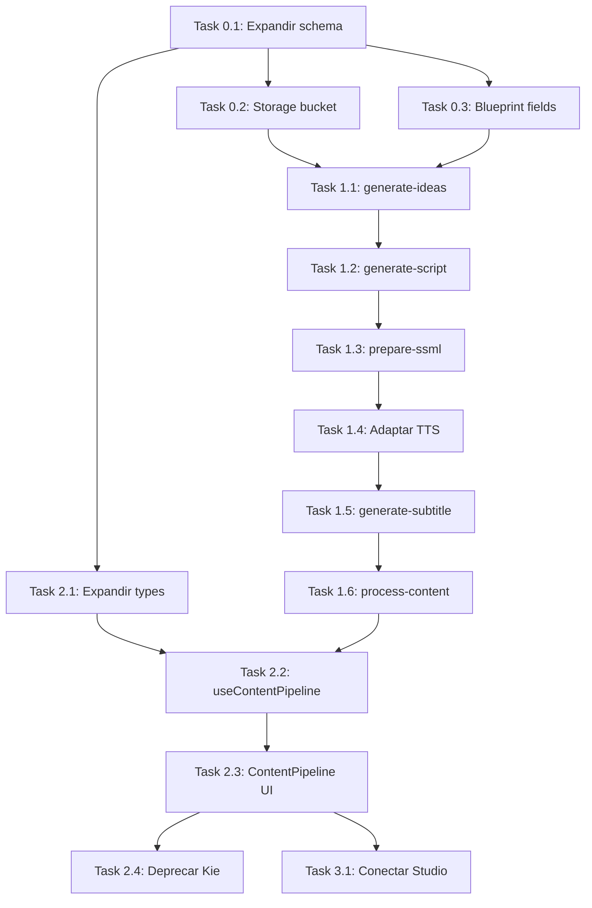

# 🎬 PLAN: Pipeline de Conteúdo Automatizado (Inspirado no N8N)

> **Objetivo:** Migrar TODA a lógica dos 2 workflows N8N para Edge Functions nativas do AutoDark, controladas pela UI.
> **Projeto Supabase:** `Autodark` (`bwitfpvqruwikpuaiurc`) — us-east-1
> **Tipo:** WEB (Vite + React + Supabase Edge Functions)
> **Data:** 2026-03-03

---

## 📊 Inventário: O Que Já Temos

### Supabase (Projeto `bwitfpvqruwikpuaiurc`)

| Recurso | Status | Observações |
|---------|--------|-------------|
| **Projeto** | ✅ ACTIVE_HEALTHY | PostgreSQL 17, us-east-1 |
| **Auth** | ✅ Funcionando | Login/cadastro operacional |
| **RLS** | ✅ Todas tabelas | `owns_channel()` helper function |

#### Tabelas Existentes

| Tabela | Rows | Colunas Chave | Suficiente? |
|--------|------|---------------|-------------|
| `channels` | 1 | id, user_id, name, niche, requires_review | ✅ Sim |
| `channel_blueprints` | 0 | channel_id, topic, voice_id, voice_name, script_rules, persona_prompt | ✅ Sim (tem voice config) |
| `channel_contents` | 0 | channel_id, title, status, scheduled_date | ❌ **FALTAM** colunas: script, audio_path, subtitle_path, audio_duration, nicho_slug |
| `content_ideas` | 0 | channel_id, title, concept, reasoning, score, status | ✅ Sim (pra fase de ideias) |
| `channel_prompts` | 0 | channel_id, name, prompt_template, variables | ✅ Sim |
| `channel_metrics` | 0 | channel_id, rpm, views, watch_time_minutes | ✅ Sim |

#### Edge Functions Deployed

| Function | Status | O Que Faz | Reutilizável? |
|----------|--------|-----------|---------------|
| `generate-strategy` | ✅ v1 | Gera ideias de conteúdo via OpenRouter → salva em `content_ideas` | ✅ Base para `generate-ideas` |
| `scrape-youtube-channel` | ✅ v1 | Importa canal do YouTube via Apify | ✅ Independente |
| `sync-youtube-metrics` | ✅ v1 | Sincroniza métricas YouTube | ✅ Independente |
| `generate-kie-flow` | ✅ v1 | Mock da Kie.ai (deprecated) | 🔄 Será **substituída** |
| `youtube-long-engine` | ✅ v2 | Gera roteiro longo via OpenRouter (gemini-2.5-flash) | 🔄 Base para `generate-script` |
| `youtube-generate-audio` | ✅ v1 | TTS via ai33.pro (OpenAI TTS wrapper) | ✅ Reutilizável diretamente |

#### Storage Buckets
| Bucket | Status |
|--------|--------|
| Nenhum configurado | ❌ **Precisa criar** `content-media` para áudios e legendas |

### Frontend (Vite + React)

| Componente | Status | Localização |
|------------|--------|-------------|
| `LongVideoStudio.tsx` | ✅ Funcional | `/pages/LongVideoStudio.tsx` — Gera roteiro, edita cenas, TTS por bloco, FFmpeg.wasm |
| `KieGenerator.tsx` | 🔄 Deprecated | `/components/ui/kie-generator.tsx` — Será substituído |
| `useContents.tsx` | ✅ Funcional | CRUD básico em `channel_contents` |
| `useContentIdeas.tsx` | ✅ Funcional | CRUD em `content_ideas` |
| FFmpeg.wasm | ✅ Integrado | No `LongVideoStudio` |

---

## 🗺️ Mapeamento: N8N → AutoDark

### Workflow 1: Geração de Ideias + Roteiro (Shorts/Curtos)

```
N8N Flow:
cron → config → GPT-4o (ideias) → normalizar → GPT-4o (roteiro) → salvar DB

AutoDark Equivalente:
UI Button → Edge Function `generate-content-pipeline` → Supabase `channel_contents`
```

| Nó N8N | Equivalente AutoDark | Status |
|--------|----------------------|--------|
| `cron trigger` | Botão na UI (ou pg_cron futuro) | 🆕 UI trigger |
| `config canal` | `channel_blueprints` (topic, voice_id, script_rules) | ✅ Já existe |
| `ideia` (GPT-4o-mini) | Nova Edge Function: `generate-ideas` | 🆕 Criar |
| `normalizar dados` | Lógica interna da Edge Function | 🆕 Criar |
| `roteiro` (GPT-4o-mini) | Nova Edge Function: `generate-script` (curto) | 🆕 Criar |
| `Create a row1` (Supabase) | Salvar em `channel_contents` (expandida) | 🔄 Migrar schema |

### Workflow 2: TTS + Legenda + Upload

```
N8N Flow:
cron → busca pendentes → SSML → Google TTS → Whisper legenda → Upload Storage → Update DB

AutoDark Equivalente:
UI Button por item → Edge Function `process-tts` → Storage → Update `channel_contents`
```

| Nó N8N | Equivalente AutoDark | Status |
|--------|----------------------|--------|
| `cron` → `busca pendentes` | UI lista items `pending_tts` | 🆕 UI component |
| `prepara texto` (SSML + fonemas) | Lógica dentro da Edge Function | 🆕 Criar |
| `Message a model` (SSML via GPT) | Nova Edge Function: `prepare-ssml` | 🆕 Criar |
| `Switch` (biblico/ciencias) | Config de voz no `channel_blueprints` | ✅ Já existe (voice_id, voice_name) |
| `text-to-speech` (Google Cloud) | Existente: `youtube-generate-audio` (ai33.pro) | ✅ Reutilizar |
| `Code in JavaScript` (duração) | Lógica no frontend (FFmpeg.wasm) ou Edge | 🔄 Adaptar |
| `gera legenda` (Whisper) | Nova Edge Function: `generate-subtitle` | 🆕 Criar |
| `sobe audio no storage` | Nova Edge Function ou direto do frontend | 🆕 Criar |
| `sobe legenda no storage` | Nova Edge Function ou direto do frontend | 🆕 Criar |
| `Update a row` | `useContents.updateContent()` expandido | 🔄 Adaptar |
| `erro tts` / `erro storage` | Status machine no `channel_contents.status` | 🆕 Implementar |

---

## 🍳 Receita de Ingredientes (Lista Completa)

### Fase 0: Schema & Infraestrutura

#### Task 0.1: Expandir tabela `channel_contents`
- **Agent:** `database-architect`
- **Prioridade:** P0 (bloqueante)
- **INPUT:** Schema atual de `channel_contents` (apenas: id, channel_id, title, status, scheduled_date)
- **OUTPUT:** Migration SQL adicionando colunas:
  ```
  + script TEXT                    -- roteiro gerado
  + hook TEXT                      -- gancho do vídeo
  + topic TEXT                     -- tema/milagre
  + angle TEXT                     -- ângulo narrativo
  + character TEXT                 -- personagem central
  + reference TEXT                 -- referência bíblica/fonte
  + nicho_slug TEXT                -- slug do nicho (biblico, ciencias, etc)
  + audio_path TEXT                -- path no Storage: {nicho}/audios/audio_{id}.mp3
  + subtitle_path TEXT             -- path no Storage: {nicho}/legendas/legenda_{id}.srt
  + audio_duration NUMERIC(10,3)   -- duração em segundos
  + ssml_cache TEXT                -- SSML processado (cache para re-TTS)
  + error_log TEXT                 -- log de erros para retry
  ```
- **VERIFY:** Coluna `status` suporta: `draft`, `idea_generated`, `script_generated`, `pending_tts`, `tts_processing`, `tts_done`, `tts_failed`, `audio_storage_failed`, `subtitle_generated`, `published`

#### Task 0.2: Criar Storage Bucket `content-media`
- **Agent:** `database-architect`
- **Prioridade:** P0 (bloqueante)
- **INPUT:** Bucket não existe
- **OUTPUT:** Bucket `content-media` com pastas: `{channel_id}/audios/`, `{channel_id}/legendas/`
- **VERIFY:** Upload/download funciona com service_role key

#### Task 0.3: Adicionar `reference` ao Blueprint
- **Agent:** `database-architect`
- **Prioridade:** P1
- **INPUT:** `channel_blueprints` não tem campo para fonte de referência (ex: "Bíblia Sagrada")
- **OUTPUT:** 
  ```
  + reference TEXT      -- ex: "Bíblia Sagrada", "Artigos Científicos"
  + cta TEXT            -- Call-to-action padrão do canal
  + char_limit INTEGER  -- limite de caracteres do roteiro (default 500)
  + videos_per_batch INTEGER -- quantos vídeos gerar por vez (default 4)
  ```
- **VERIFY:** `channel_blueprints` aceita insert com novos campos

---

### Fase 1: Edge Functions (Pipeline de Geração)

#### Task 1.1: Edge Function `generate-ideas`
- **Agent:** `backend-specialist`
- **Prioridade:** P0
- **Dependência:** Task 0.1
- **INPUT:** `{ channelId }` → Lê `channel_blueprints` (topic, reference, videos_per_batch, persona_prompt)
- **OUTPUT:** Gera N ideias via OpenRouter (GPT-4o-mini), salva em `channel_contents` com status `idea_generated`
- **Lógica inspirada no N8N:** Prompt do nó "ideia" que gera JSON com hooks, topics, characters, references, angles
- **VERIFY:** Chamada retorna array de ideias salvas com IDs

#### Task 1.2: Edge Function `generate-script`
- **Agent:** `backend-specialist`
- **Prioridade:** P0
- **Dependência:** Task 1.1
- **INPUT:** `{ contentId }` → Lê item de `channel_contents` + `channel_blueprints` (char_limit, cta, script_rules)
- **OUTPUT:** Gera roteiro curto via OpenRouter, atualiza `channel_contents.script`, status → `script_generated`
- **Lógica inspirada no N8N:** Prompt do nó "roteiro" com limite de chars, hook obrigatório, referência e CTA
- **VERIFY:** `channel_contents.script` preenchido, status = `script_generated`

#### Task 1.3: Edge Function `prepare-ssml`
- **Agent:** `backend-specialist`
- **Prioridade:** P1
- **Dependência:** Task 1.2
- **INPUT:** `{ contentId }` → Lê `channel_contents.script` + `channel_blueprints.nicho`
- **OUTPUT:** SSML processado com fonemas IPA, pausas, prosody → salva em `channel_contents.ssml_cache`
- **Lógica inspirada no N8N:**
  - Correção fonética de nomes próprios (`<phoneme>`)
  - Divisão em frases com `<break time="300ms"/>`
  - Tag `<speak>` wrapper
  - Nicho slug gerado e salvo
- **VERIFY:** SSML parseável, nicho_slug preenchido

#### Task 1.4: Adaptar `youtube-generate-audio` para aceitar SSML
- **Agent:** `backend-specialist`
- **Prioridade:** P1
- **Dependência:** Task 1.3
- **INPUT:** Atualmente aceita `{ text, voice }` — precisa aceitar `{ ssml, voice }` também
- **OUTPUT:** Retorna MP3 blob como já faz, mas usando SSML quando fornecido
- **Nota:** Se ai33.pro não suportar SSML, usar Google Cloud TTS como fallback
- **VERIFY:** Áudio gerado com pausas e pronúncia correta

#### Task 1.5: Edge Function `generate-subtitle`
- **Agent:** `backend-specialist`
- **Prioridade:** P1
- **Dependência:** Task 1.4
- **INPUT:** `{ contentId, audioBuffer }` → Envia áudio para OpenAI Whisper (via ai33.pro ou direto)
- **OUTPUT:** Retorna SRT, faz upload para Storage, atualiza `channel_contents.subtitle_path`
- **Lógica inspirada no N8N:** Whisper `response_format: "srt"`
- **VERIFY:** Arquivo .srt no Storage, path salvo no DB

#### Task 1.6: Edge Function `process-content` (Orquestrador)
- **Agent:** `backend-specialist`
- **Prioridade:** P2
- **Dependência:** Tasks 1.1–1.5
- **INPUT:** `{ contentId, steps: ['ssml', 'tts', 'subtitle'] }` 
- **OUTPUT:** Executa pipeline completa para um conteúdo:
  1. SSML → 2. TTS → 3. Upload áudio → 4. Whisper → 5. Upload legenda → 6. Update DB
- **Status machine completa com error handling:**
  - `pending_tts` → `tts_processing` → `tts_done` / `tts_failed`
  - `tts_done` → `subtitle_generated` / `audio_storage_failed`
- **VERIFY:** Item percorre todos os estados com sucesso

---

### Fase 2: Frontend (UI de Controle)

#### Task 2.1: Expandir `useContents.tsx` com novos campos
- **Agent:** `frontend-specialist`
- **Prioridade:** P0
- **Dependência:** Task 0.1
- **INPUT:** Hook atual só tem: id, channel_id, title, status, scheduled_date
- **OUTPUT:** Adicionar tipos para todos os novos campos (script, hook, audio_path, etc)
- **VERIFY:** Types compilam sem erros

#### Task 2.2: Novo Hook `useContentPipeline.tsx`
- **Agent:** `frontend-specialist`
- **Prioridade:** P1
- **Dependência:** Tasks 1.1–1.6
- **INPUT:** Necessidade de orquestrar as Edge Functions
- **OUTPUT:** Hook que expõe:
  - `generateIdeas(channelId)` → chama `generate-ideas`
  - `generateScript(contentId)` → chama `generate-script`
  - `processAudio(contentId)` → chama pipeline TTS+subtitle
  - `retryFailed(contentId)` → re-processa items com status `*_failed`
  - Estado de loading/progress por item
- **VERIFY:** Cada função atualiza o estado corretamente

#### Task 2.3: Componente `ContentPipeline.tsx` (Painel de Controle)
- **Agent:** `frontend-specialist`
- **Prioridade:** P2
- **Dependência:** Tasks 2.1, 2.2
- **INPUT:** Não existe UI para o fluxo de conteúdo curto
- **OUTPUT:** Componente com:
  - Botão "Gerar X Ideias" → dispara `generate-ideas`
  - Lista de cards com status badges (draft → idea → script → tts → done)
  - Botão "Gerar Roteiro" por card
  - Botão "Processar Áudio" por card
  - Player de áudio inline quando `tts_done`
  - Botão "Retry" para items falhados
  - Indicador de progresso visual
- **VERIFY:** Fluxo completo roda pela UI

#### Task 2.4: Substituir `KieGenerator.tsx` (Deprecation)
- **Agent:** `frontend-specialist`
- **Prioridade:** P3
- **Dependência:** Task 2.3
- **INPUT:** `kie-generator.tsx` é mock da Kie.ai
- **OUTPUT:** Remover referências à Kie.ai, substituir por `ContentPipeline`
- **VERIFY:** Nenhuma referência a "Kie" no codebase

---

### Fase 3: Integração com LongVideoStudio

#### Task 3.1: Conectar LongVideoStudio ao pipeline
- **Agent:** `frontend-specialist`
- **Prioridade:** P3
- **Dependência:** Tasks 2.1–2.3
- **INPUT:** `LongVideoStudio` já gera roteiros longos e tem TTS por bloco
- **OUTPUT:** Adicionar opção de salvar roteiro gerado como `channel_contents` com status `script_generated`
- **VERIFY:** Roteiro do Studio aparece na lista de conteúdos

---

## ⏱️ Estimativa de Tempo

| Fase | Tasks | Esforço | Dependência |
|------|-------|---------|-------------|
| **Fase 0** | 0.1–0.3 | ~30min | Nenhuma |
| **Fase 1** | 1.1–1.6 | ~3h | Fase 0 |
| **Fase 2** | 2.1–2.4 | ~2h | Fases 0+1 |
| **Fase 3** | 3.1 | ~30min | Fase 2 |
| **TOTAL** | 12 tasks | ~6h | — |

---

## 🛡️ Riscos & Mitigações

| Risco | Impacto | Mitigação |
|-------|---------|-----------|
| ai33.pro não suporta SSML | TTS sem fonemas/pausas | Usar Google Cloud TTS como fallback |
| Whisper timeout em áudios longos | Legenda não gerada | Limitar a shorts (~60s), retry automático |
| Storage CORS | Frontend não faz upload | Configurar CORS no bucket |
| Edge Function timeout (50s) | Pipeline completa não cabe | Separar em funções menores (já planejado) |

---

## 📋 Checklist de Verificação (Fase X)

- [ ] Migration aplicada com sucesso
- [ ] Storage bucket criado e acessível
- [ ] `generate-ideas` retorna e salva ideias
- [ ] `generate-script` gera roteiro dentro do char_limit
- [ ] `prepare-ssml` gera SSML válido com fonemas
- [ ] `youtube-generate-audio` aceita SSML
- [ ] `generate-subtitle` retorna SRT e faz upload
- [ ] `process-content` executa pipeline completa
- [ ] UI mostra status badges corretos
- [ ] Player de áudio funciona
- [ ] Retry de items falhados funciona
- [ ] `npm run build` sem erros
- [ ] Types Supabase regenerados

---

## 🏗️ Ordem de Execução Recomendada


